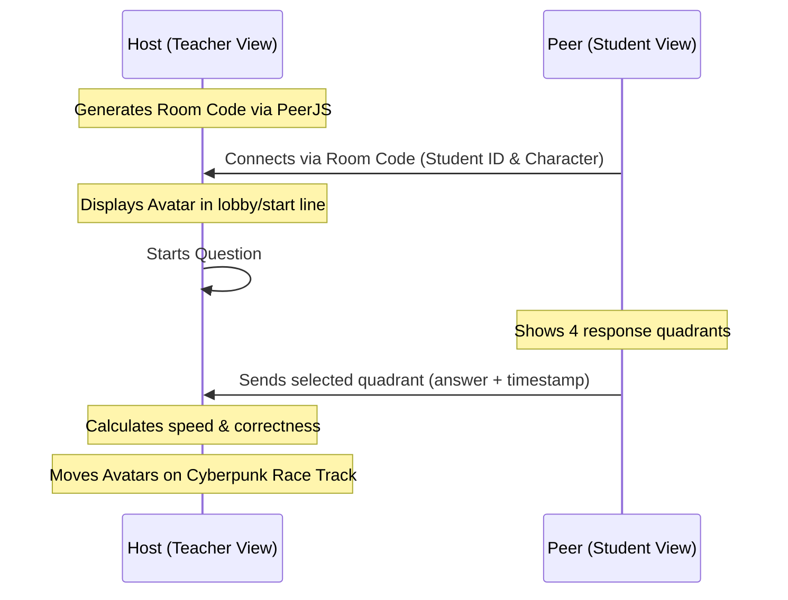

# Proposal: Interactive Avatar Board

## Intent
Allow teachers to present custom questions where students join via their own devices, choose anime/hero characters with traceable Student IDs, submit answers in real-time (drag/click), and compete on a cyberpunk-themed race dashboard ranked by speed and correctness.

## Capabilities
| Capability | Type | Description |
| :--- | :--- | :--- |
| `avatar-board` | New | Real-time interactive avatar board (Teacher View, Student Controller View, P2P sync via PeerJS, Leaderboard, Cyberpunk UI). |

## Architecture & Technology Stack
- **Architecture**: Dual-view responsive HTML5/Vanilla CSS/Vanilla JS Single-Page App (SPA).
  - *Teacher View*: Displays active question, 4 response quadrants, real-time avatar movement, local simulator, and a PeerJS signaling host setup.
  - *Student Controller View*: Joins host session via room code, sets Student ID, selects character, and taps quadrants to submit answers.
- **Tech Stack**:
  - Frontend: Vanilla HTML5, CSS (Cyberpunk theme with CSS Grid/Flexbox, custom animations, custom font loader), modern Javascript (ES6 modules).
  - P2P Data Sync: PeerJS (via CDN) for direct WebRTC connection. No backend database required.

## User Flow

## Risks & Rollback Plan
| Risk | Mitigation | Rollback Plan |
| :--- | :--- | :--- |
| PeerJS signaling server public peerjs.com offline / blocked | Bundle local mock signaling or fallback peer server configuration. | Revert to Local Simulator mode via toggle, bypassing PeerJS initialization. |
| Browser incompatibilities with WebRTC or Touch/Drag | Use simple touch/click handlers on mobile; standard library features. | Degrade gracefully to simple click/tap controls; fallback CSS layouts. |
